  README

## Μέρος πρώτο

1) Οι παράμετροι τις  οποίες  παίρνει το  python  script  starter.py  είναι οι εξής
-   cpu: Η παράμετρος cpu ορίζει το μοντέλο της CPU του υπολογιστικού συστήματος το οποίο θα προσομοιωθεί (αν δεν οριστεί τιμή θα τεθεί το μοντέλο της cpu atomic).

-   cpu-freq: Η παράμετρος –cpu-freq ορίζει την συχνότητα του ρολογιού του επεξεργαστή του συστήματος (αν δεν οριστεί τιμή θα τεθεί αυτόματα η συχνότητα ρολογιού 1GHz).

-   num-cores: Η παράμετρος  –num-cores ορίζει τον αριθμό των πυρήνων τους οποίους περιέχει το υπολογιστικό σύστημα το οποίο θα προσομοιωθεί (αν δεν οριστεί τιμή θα τεθεί αυτόματα το σύστημα που θα προσομοιωθεί να έχει ένα πυρήνα ).
-   mem-channels: Η παράμετρος mem-channels ορίζει τον αριθμό των διαύλων επικοινωνίας μεταξύ μνήμης και επεξεργαστή (αν δεν οριστεί τιμή θα είναι δύο)
-  mem-type: Η παράμετρος  --mem-type ορίζει τον τύπο της μνήμης του συστήματος το οποίο θα προσομοιωθεί (αν δεν οριστεί τιμή θα τεθεί αυτόματα η DDR_1600_8x8 ως μνήμη του συστήματος)
-   mem-ranks: O αριθμός των --mem-ranks ορίζει τον αριθμό των βαθμίδων μνήμης που θα χρησιμοποιηθούν
-   mem-size: ορίζει το φυσικό μέγεθος της μνήμης του συστήματος (αν δεν τεθεί κάποια τιμή λαμβάνεται αυτόματα η τιμή των 2 GB  )
- cache_line_size: ορίζει το μέγεθος του block  της cache(αν δεν οριστεί το μέγεθος είναι 64bytes)

2) Εκτελέσαμε το παράδειγμα hello μέσω  του gem5 και προέκυψαν τα παρακάτω

    2α) Στο αρχείο config.ini  βλέπουμε ότι

- ranks_per_channel=2 : Oπως περιμέναμε ορίστηκε ο   αριθμός των memory_ranks  να είναι δύο καθώς δεν χρησιμοποιήσαμε στην εκτέλεση του script  της προσομοίωσης την --mem-channels  flag

- type=MinorCpu : O  τύπος της cpu  που χρησιμοποιήθηκε είναι το μοντέλο minor  καθώς προσθέσαμε την --cpu="minor" flag  κατά την εκτέλεση του script  

- clock=1000: Η περίοδος του ρολογιού είναι 1000ps  το όπως περιμέναμε καθώς η default τιμή του ρολογιού είναι 1Ghz 

- cache_line_size=64: To  μήκος του block  size  της cache  είναι 64byte  η οποία είναι και η default τιμή 

2β)  Ανατρέχοντας στα στατιστικά τα οποία προέκυψαν από την προσομοίωση και βρίσκονται στο stats.txt παρατηρούμε τα εξής 

- sim_seconds=0.000036 : O χρόνος τον οποίο απαιτεί το πρόγραμμα να τρέξει στον  εξομοιωμένο επεξεργαστή

- sim_insts=5310 : Ο αριθμός των εντολών οι οποίες έγιναν committed  από την cpu (χωρίς να λαμβάνονται υπόψιν τα micro ops)

- host_inst_rate=57847: O  αριθμός των εντολών στην μονάδα του χρόνου το οποίο μας δείχνει και την απόδοση που είχε το gem5 όταν το τρέξαμε στο μηχάνημα μας

- system.cpu.cluster.l2_overall_accesses=473 :O  συνολικός αριθμός των προσπελάσεων από την L2

2γ) Αν παρατηρήσουμε στο αρχείο stats.txt  βλέπουμε   δύο μεταβλητές την system.cpu_cluster_cpu.cpus.commitedOp και την system.cpu_cluster_cpu.cpus.commitedInsts  οι οποίες είναι ίσες με 5953 και 5143 αντίστοιχα. Η πρώτη παράμετρος μας δείχνει τον συνολικό αριθμό όλων των committed  εντολών λαμβάνοντας υπόψιν τα micro  ops  τα οποία είναι τα μικρότερα tasks  τα οποία μπορεί να εκτελέσει ο επεξεργαστής με εντολές assembly  οι οποίες παίρνουν έναν κύκλο ρολογιού και είναι ο συνολικός αριθμός των commited  εντολών ενώ το δεύτερο υπολογίζει το άθροισμα με βάση τις ποιο σύνθετες εντολές.

2δ) Παρατηρούμε ότι στο stats.txt γράφεται ότι system.cpu.cluster.l2_overall_accesses=473 συνεπώς O  συνολικός αριθμός των προσπελάσεων από την L2 είναι 473. Αν θέλαμε να υπολογίσουμε διαφορετικά τις προσπελάσεις μνήμης θα έπρεπε να αθροίσουμε τον αριθμό των hits  της L2 και τον αριθμό των misses  της L2

3)To  gem5 μας δίνει την δυνατότητα να  χρησιμοποιήσουμε τα παρακάτω μοντέλα επεξεργαστών:

MinorCPU

Το Minor είναι  ένα  μοντέλο in-order επεξεργαστή  το  οποίο  χρησιμοποιεί  τέσσερα pipeline stages(fetch1,fetch2, decode,execute) και branch prediction. Προορίζεται να χρησιμοποιηθεί για τη μοντελοποίηση επεξεργαστών in-order και επιτρέπει την οπτικοποίηση της θέσης μιας εντολής μέσα στο pipeline.

AtomicSimpleCPU

To  AtomicSimpleCPU  είναι μια έκδοση της SimpleCPU που χρησιμοποιεί ατομικές προσπελάσεις στην μνήμη . Οι ατομικές προσπελάσεις είναι πολύ γρήγορες προσπελάσεις οι οποίες χρησιμοποιούνται για προθέρμανση της κρυφής μνήμης και δίνουν έναν προσεγγιστικό χρόνο για την εγγραφή ή την ανάγνωση στην μνήμη.

TimingSimpleCPU

Η είναι μια έκδοση της SimpleCPU που χρησιμοποιεί χρονικές προσπελάσεις στην μνήμη. Στις χρονικές προσπελάσεις το σύστημα καθυστερεί στην κρυφή μνήμη και περιμένει την απόκριση του συστήματος της μνήμης πριν προχωρήσει. Μπορούμε να την φανταστούμε σαν μία CPU  όπου κάθε εντολή παίρνει έναν κύκλο ρολογιού και όμως παίρνουμε έναν ρεαλιστικό χρόνο για τις προσπελάσεις στην μνήμη. 

Ο3 cpu model

To O3 εξομοιώνει  ένα  μοντέλο out-of order cpu το  οποίο  περιλαμβάνει branch prediction ,register renaming, reorder buffer.Περιλαμβάνει  τέσσερα  στάδια fetch decode ,rename, issue execute write back και commit. Έχει timing  buffers  ανάμεσα στα στάδια ώστε να παρμετροποιήθει ο χρόνος που παίρνει κάθε στάδιο.

3αβ) Εκτελέσαμε για δύο διαφορετικά cpu  models  τo  minorCPU  και το timingSimpleCPU  και βλέπουμε ότι ο χρόνος εκτέλεσης του προγράμματος για το minorCPU  μοντέλο είναι 0.000034 seconds  ενώ για το timingSimpleCPU  είναι 0.000039 seconds. Καθώς η timing  simple  μας δίνει μια πιο καλή χρονική εκτίμηση είναι λογικό να έχουμε μια διαφορά στον χρόνο.

3γ) Αφού τρέξαμε μια προσομοίωση με clk 2 Ghz  , και μια με μνήμη DDR3 2400_8x8 για το minorCPU  και το ΤimingSimpleCPU για το specbzip  δεν παρατηρείται καμία αισθητή διαφορά

## Μέρος δεύτερο
1) Στο αρχείο config.ini παίρνουμε τις πληροφορίες που χρειαζόμαστε για το L1 instruction,L1 DataCache, L2 cache , Cache Line καθώς και το associativity αυτών

| Cache Type         | Size     |
|--------------------|----------|
| L1 Instruction     | 32768    |
| L1 Data Cache      | 65536    |
| L2 Cache           | 0        |
| Cache Line         | 64       |
| Associativity      | 2        |

2) Aφού εκτελέσαμε τα scripts για κάθε benchmark πήραμε τα παρακάτω στατιστικά για τοv xρονο εκτέλεσης, το CPI, Τα συνολικά miss rates της L1 cache, της L1 instruction cache και της L2 cache 

| Benchmark  | sim-seconds | CPI    | dcache-miss-rate | icache-miss-rate | l2-overall-miss-rate |
|------------|-------------|--------|------------------|------------------|----------------------|
| Specbzip   | 0.0083982   | 1.7689 | 0.01478          | 7.7e-5           | 0.2821               |
| Spechmmer  | 0.005936    | 1.187  | 0.01637          | 0.000221         | 0.07710              |
| Speclibm   | 0.174671    | 3.49   | 0.060972         | 0.000094         | 0.99994              |
| Specmcf    | 0.174671    | 3.49   | 0.060972         | 0.000094         | 0.99994              |
| Specsjeng  | 0.513528    | 10.27  | 0.121831         | 0.00002          | 0.99972              |

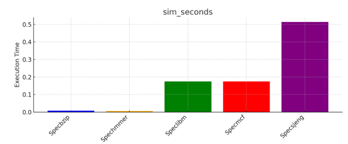
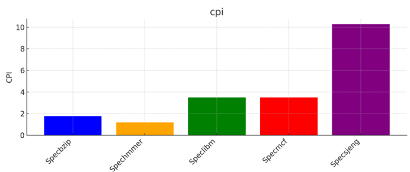
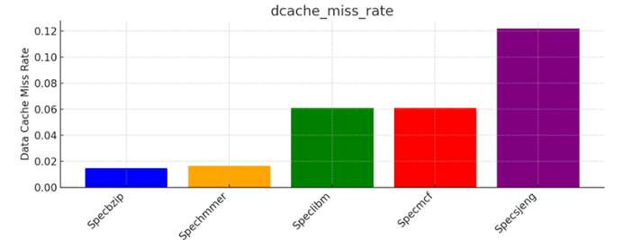
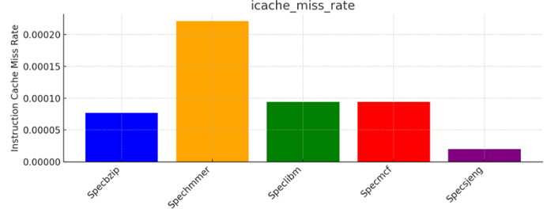
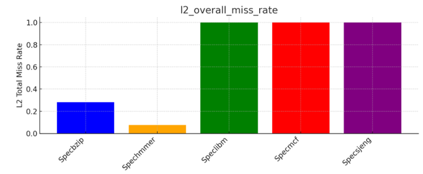

3) Παρατηρόντας το config.ini  αρχείο παρατηρούμε ότι clk_domain.clock=1000 και ότι cpu_clk_domain.clock  =1000 ps  το οποίο το πρώτο αντιστοιχεί στο system.clk_domain.clock  το οποίο αντιπροσωπεύει την περίοδο του ρολογιού του επεξεργαστή και το δεύτερο αντιστοιχεί στο system.cpu_clk_domain.clk το οποίο αντιστοιχεί στην περίοδο ρολογιού των υποσυστημάτων(domains) του εξομοιωμένου συστήματος τα οποία δουλεύουν με ένα κοινό ρολόι κάτω από την ίδια συχνότητα . Αν αυξήσουμε την συχνότητα του ρολογίου από 1Ghz  σε 3 Ghz  τότε θα παρατηρήσουμε στο config.ini  αρχείο ότι η περίοδος των domains  παραμένει η ίδια (clk_domain.clock=1000 ps) ενώ η περίοδος του ρολογιού υποτριπλασιάζεται (cpu_clk_domain.clock  =330 ps). Αν προσθέσουμε έναν ακόμα επεξεργαστή τότε η συχνότητα του θα είναι 1Ghz. Για τις συχότητες του ρολογιού 1Ghz και 3Ghz παρατηρούμε ότι οι χρόνοι εκτέλεσης του benchmark specbzip είναι αντίστοιχα 0.16 και 0.058 ,έχουμε λοιπόν scaling γύρω στο 2.67. Ο λόγος που δεν έχουμε τέλειο scaling έιναι ότι κατθώς αυξάνουμε την συχνότητα του ρολογιού ο χρόνος για να φορτιστουν οι χωρητικότητες μεταξύ των μέταλλων αυξάνεται συνεπώς δεν γίνεται αν υπάρξει τέλειο scaling .

4) Αφού εκτελέσαμε δύο διαφορετικές προσομοιώσεις για δύο διαφορετικές μνήμες για το benchmark  specbzip  δεν παρατηρήθηκε καμία μεγάλη διαφορά στα στατιστικά το οποίο είναι λογικό καθώς τα overall  misses  είναι πάρα πολύ λίγα για την L2 συνεπώς δεν είναι και πολλές οι προσπελάσεις στην DRAM  ούτως ή άλλως για να παρατηρηθεί κάποια σημαντική διαφορά
## Μέρος Τρίτο
Για το τρίτο μέρος ξεκινώντας από τις default τιμές και σταδιακά αλλάξαμε τις παραμέτρους μία κάθε φορά και παρατηρήσαμε την μέιωση του cpi για κάθε benchmark χρησιμοποιώντας ένα εκατομμύριο εντολές για  τις προσομοιώσεις αντί για δέκα εκατομμύρια όπως φαίνεται στο παράδειγμα της εκφώνησης.Συγκρκριμένα για το benchmark specbzip όταν αυξάνουμε το associativity της L2 και το cacheline παρατηρείται μεγαλυτερη μέιωση του CPI. Αντίστοιχα για το benchmark spechmmer βλέπουμε μεγαλύτερη μείωση όταν αυξήσουμε την L1 icache . Όσων αφορά το specmcf παρατηρείται μεγαλύτερη διαφορά όταν αυξήσουμε την L1 dcache.Για το speclibm πετυχαίνουμε μεγαλύτερη αύξηση του cpi για όταν αυξήσουμε το cacheline και το associativity της L1 icache. Τέλος για το specsjeng πετυχαίνουμε μεγαλύτερη μείωση του cpi όταν αυξήσουμε την L1i associativity. Για την δημιουργία των φακέλων με τα αποτελέσματα έγινε πέντε διαφορετικών bash script search_seq.sh τα οποίο βρίσκόνται σε ξεχωριστό φάκελο για καθένα απ τα benchmark. Για την εξαγωγή των cpi έγινε η χρήση του script extract_cpi_seq.sh για καθένα από τα αποτελέσματα των benchmarks. Μαζί με τις παραπάνω δοκιμές έγιναν και κάπιοιες ακόμα δοκιμές οπού χρησιμποιώντας ένα συγκεκριμένο σύνολο τιμών έγινε μια grid search για την ευρέση των παραμέτρων που βγάζουν το ελάχιστο CPI μεσω των αρχείων search_grid.sh και extract_grid_search_cpi.sh για κάθε benchmark. H μέθοδος αυτή εγκαταλείφθηκε διότι ήταν πολύ δύσκολη η απεικόνιση των αποτελεσμάτων.   

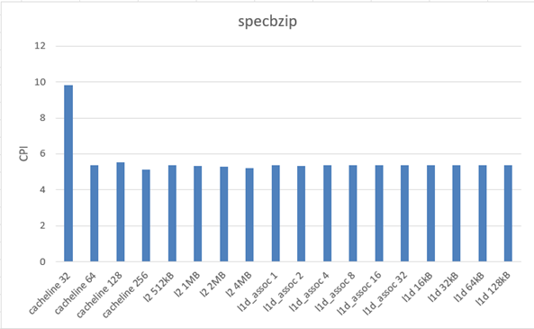
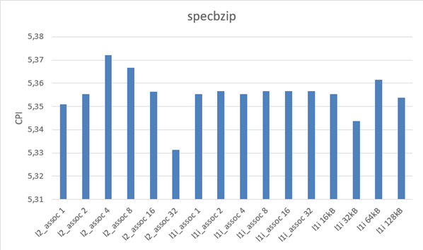
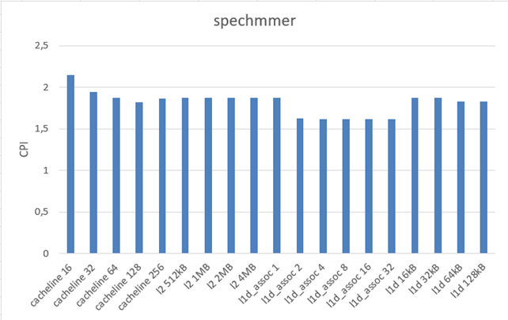
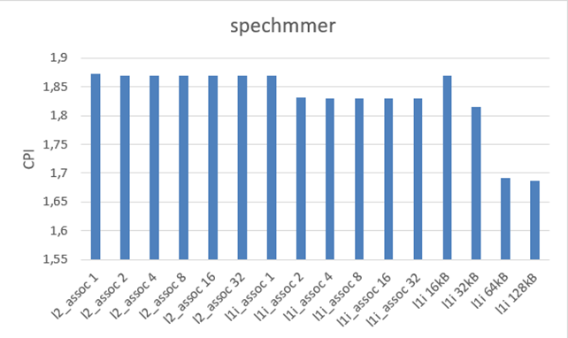
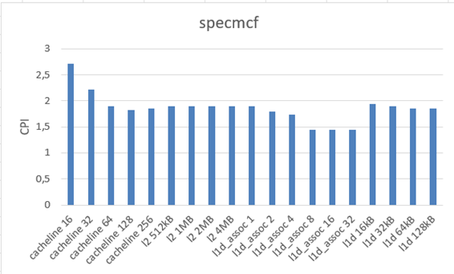
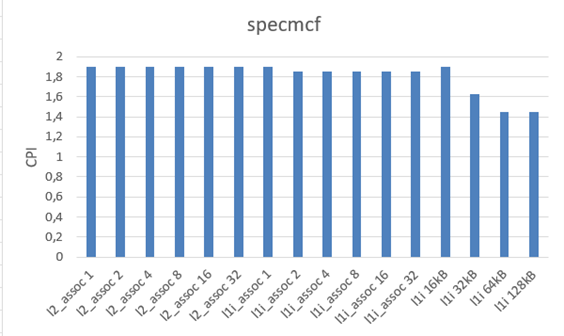
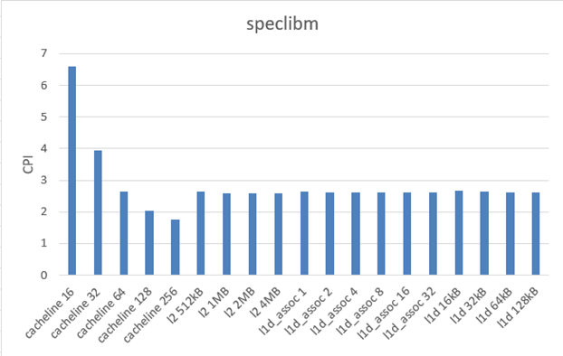
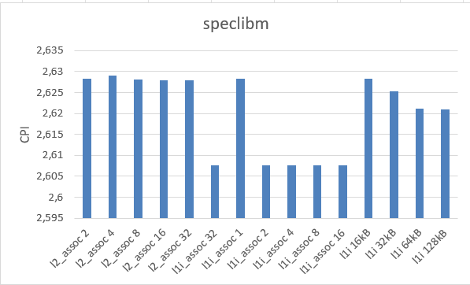
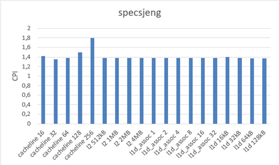
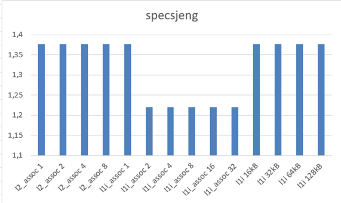

## Cost Function

Για να βρούμε την συναρτηση κόστους θεωρούμε το άθροισμα των παραμέτρων των μνημών , όπου κάθενα από τις παραμέτρους είναι πολλαπλασιασμένο με τους εξής παράγοντες ci, και si (όπου i=1..6). Ο παράγοντας si είναι ένας speed factor όπου προκύπτει υπολογίζοντας το sk = (cpi1-cpi2)/(min_paramer_val-max_parameter_val) για καθένα από τα benchmarks και υπολογίζοντας τον μεσο όρο έτσι ώστε να έχουμε μία εκτιμήση για το πόσο ελαττώνει το cpi με την αύξηση κάθεμίας παραμέτρου. Το ci είναι το κόστος σε πυρίτιο για κάθε μια από τις παραμέτρους. Ανατρέχοντας στην βιβλιογραφία μπορούμε να συμπαράνουμε ότι προφανώς ότι το associativity αυξάνει τον αριθμό των πυλών καθώς αυξάνεται η πολυπλοκότητα του κυκλώματος διότι οι συγκρίσεις οι οποίες πρέπει να γίνουν για να βρεθέι το ζητούμενο block στην μνήμη. Επίσης το κόστος για την L1 cache είναι μεγαλύτερο από το κόστος για την L2 cache. Επίσης το κόστος για το μέγεθος μιας μνήμης έιναι μεγαλύτερο απο το κόστος για associativity λόγω της διαφοράς στην πολυπλοκότητα των κυκλωμάτων.Ορίζουμε λοιπόν προσεγγστικά αυθαίρετα κάποιες τιμές για τα c1,..,c6 θεωρόντας ότι c3 >  c1 > c7  > c5 > c4 > c2> c6.

$$

\text{cost\_function} = 
\frac{
    \big(c_1 \cdot s_1 \cdot \frac{\text{L1\_icache}}{\text{L1\_icache\_assoc(max)}} 
    + c_2 \cdot s_2 \cdot \frac{\text{L1\_icache\_assoc}}{\text{L1\_icache\_assoc(max)}} 
    + c_3 \cdot s_3 \cdot \frac{\text{L1\_dcache\_size}}{\text{L1\_dcache\_size(max)}} 
    + c_4 \cdot s_4 \cdot \frac{\text{L1\_dcache\_assoc}}{\text{L1\_dcache\_assoc(max)}} 
    + c_5 \cdot s_5 \cdot \frac{\text{L2\_cache\_assoc}}{\text{L2\_cache\_assoc(max)}} 
    + c_6 \cdot s_6 \cdot \frac{\text{cache\_line}}{\text{cache\_line(max)}} 
    + c_7 \cdot s_7 \cdot \frac{\text{L2\_cache\_size}}{\text{L2\_cache\_size(max)}}\big)
}{
    c_1 \cdot s_1 + c_2 \cdot s_2 + c_3 \cdot s_3 + c_4 \cdot s_4 + c_5 \cdot s_5 + c_6 \cdot s_6 + c_7 \cdot s_7
}

$$
